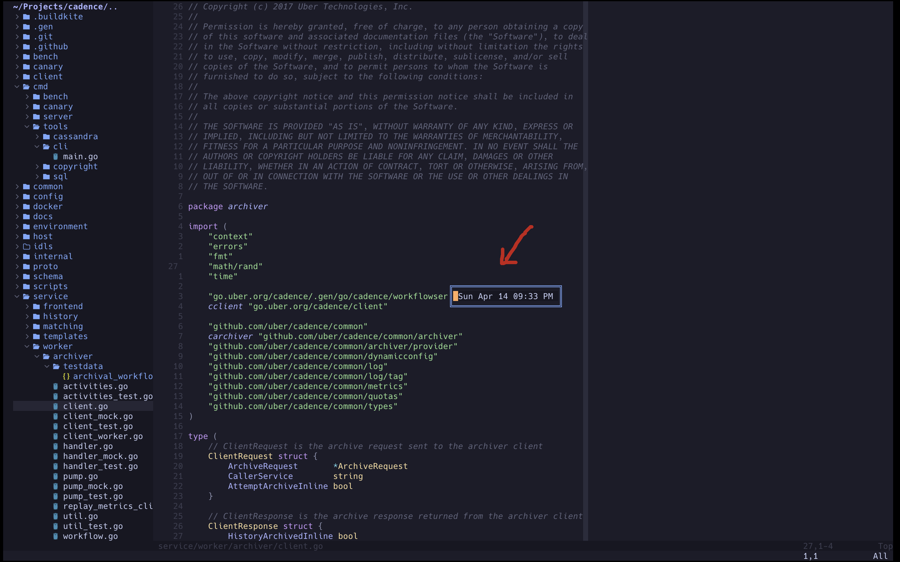

# Watch—a neovim plugin in lua

It's a very simple Neovim plugin that toggles the display of the date and time
in a floating window. It's for learning purpose.



## Motivation

Recently I've started using Neovim as my main editor. There're tons of plugins and even so many
plugins to manage plugins, in the end I made it to setup my own development 
environment, it's awesome! for instance, it's great experience with searching
files with telescope.nvim. But the process of setup was not smooth. 
Open source is not free, it demands your time and effort.

To use nvim effectively and productively, I felt need to know how plugins work,
how to build it and how to manage them. The best way to learn is to build one.

## Installation

*  My NVIM v0.9.5

Install using [lazy.nvim](https://github.com/folke/lazy.nvim)
other plugin managers like packer.nvim, vim-plug should work.

Put this plugin spec in `require("lazy").setup(...)`

```lua
{
    "qijingli/watch",
    keys = {
        {"<leader>T", "<Cmd>lua require('watch').toggle()<CR>"}
    }
}

```

## Usage

`<Leader>` + <kbd>Shift</kbd> + <kbd>t</kbd>
